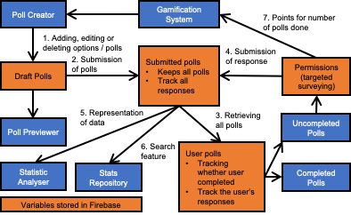

# Motivation

There are always numerous messages on unofficial NUS telegram chat groups asking for people to participate in their **polls** for their projects.

Survey requesters will not be able to validate whether the people who has done their survey are NUS students or not.

Should there be an **imposter**, the requesters would have to make do with **erroneous data**.

Sometimes, you may also wonder “On average, how much sleep does an average NUS Computer Science freshman get?” or “Where is the best Mala hotpot stall in NUS?”.

It is hard to get answers to such questions on social media as many who are not the targeted population would reply and skew the responses.

More often than not, most polls will ask the **same standard questions** about you.
This includes “faculty”, “gender”, “age” and “nationality”.

You want to help your peers by completing their polls but it is **cumbersome** to key in all of these particulars every single time.

Furthermore, there are usually **little to no benefits** when completing these polls and you most likely will not be able to see the survey results.

Also, survey requesters may not have learnt software that can help them analyse the data.
A simple table will not be enough to **illustrate** the data they have gotten.
Wouldn’t it be better to have an **all-in-one** data collection and analysis platform?

# Aim

We hope to make the data collection and analysis process quick, easy and engaging for both surveyors and respondents via the use of a web application.

# Features

## Account Verification

Ensures that the person doing the polls is from NUS, or a chosen demographic.

## Survey Studio

A customisable workspace for creators to create their polls with ease.

## Dashboard

A dashboard where users can view selected polls at a glance, acting as a homepage.

## Statistic Analyser

Allows users to utilise and visualise data collected without the need for any other external software.

## Stats Repository

Gives easy access to statistics from past surveys, while keeping individual data points anonymous.

# Program Flow

