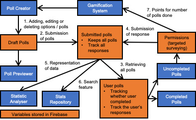

# NUStats

<a href="https://drive.google.com/file/d/1IqatGDD48L9kQP54YiurZlCv4GjSoW3g/view?usp=sharing">Link to detailed README file</a>
<<<<<<< HEAD
=======

<strong>Summary</strong>

A platform for data collection and collation.
>>>>>>> 82b75d1a85d339b803767ddc7b754427f0bc74ee

# Motivation

There are always numerous messages on unofficial NUS telegram chat groups asking for people
to participate in their polls for their projects. Survey requesters will not be able to validate
whether the people who has done their survey are NUS students or not. Should there be an
imposter, the requesters would have to make do with erroneous data. Sometimes, you may
also wonder “On average, how much sleep does an average NUS Computer Science freshman
get?” or “Where is the best Mala hotpot stall in NUS?”. It is hard to get answers to such questions
on social media as many who are not the targeted population would reply and skew the
responses.

More often than not, most surveys will ask the same standard questions about you. This
includes “faculty”, “gender”, “age” and “nationality”. You want to help your peers by completing
their surveys but it is cumbersome to key in all of these particulars every single time.
Furthermore, there are usually little to no benefits when completing these surveys and you
most likely will not be able to see the survey results.

Also, survey requesters may not have learnt software that can help them analyse the data. A
simple table will not be enough to illustrate the data they have gotten. Wouldn’t it be better
to have an all-in-one data collection and analysis platform?

# Aim

We hope to make the data collection and analysis process quick, easy and engaging for both pollers and respondents via the use of a web application.

# Features

## Account Verification

Ensures that the person doing the polls is from NUS, or a chosen demographic.

## Survey Studio

A customisable workspace for creators to create their polls with ease.

## Dashboard

A dashboard where users can view selected polls at a glance, acting as a homepage.

## Statistic Analyser

Allows users to utilise and visualise data collected without the need for any other external software.

## Stats Repository

Gives easy access to statistics from past surveys, while keeping individual data points anonymous.

# Program Flow

# Issues

As of Milestone 1:

- Data gets erased after logging out and logging in again
- The need to refresh the web app to update the text field values when submitting and deleting polls

# Timeline

### Milestone 2

| Week | Date Period | Agenda                                                                                                                 |
| ---- | ----------- | ---------------------------------------------------------------------------------------------------------------------- |
| 1    | 1 - 7 Jun   | <ul><li>Solving the issues from Milestone 1</li></ul>                                                                  |
| 2    | 8 - 14 Jun  | <ul><li>Completion of Survey Studio</li><li>Completion of Account Verification</li></ul>                               |
| 3    | 15 - 21 Jun | <ul><li>Showing the results of responses</li><li>Adding search feature that will lead up to Stats Repository</li></ul> |
| 4    | 22 - 28 Jun | <ul><li>Completion of Statistic Analyser</li></ul>                                                                     |

 

### Milestone 3

| Week | Date Period    | Agenda                                                                                                        |
| ---- | -------------- | ------------------------------------------------------------------------------------------------------------- |
| 1    | 29 Jun - 5 Jul | <ul><li>Solving the issues from Milestone 2                                                                   |
| 2    | 6 - 12 Jul     | <ul><li>Completion of Stats Repository                                                                        |
| 3    | 13 - 19 Jul    | <ul><li>Completion of Survey Dashvoard</li><li>Completion of Gamification System/targeted surveying</li></ul> |
| 4    | 20 - 26 Jul    | <ul><li>Adding pre-defined permissions for targeted surveying</li></ul>                                       |
